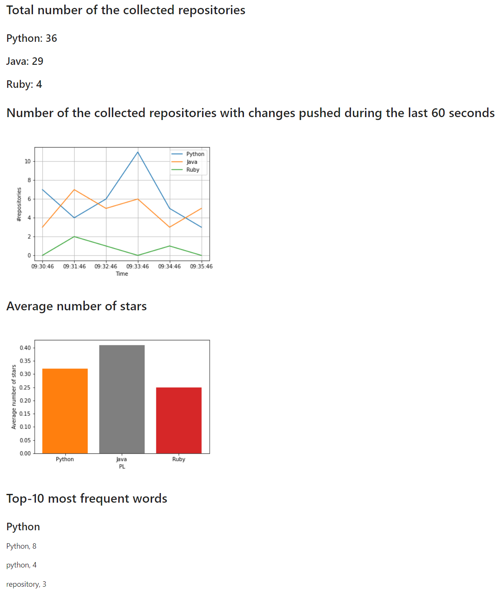

# GitHub-scraper

This project grabs data from GitHub using the GitHub search API
Data is sorted by Total number of collected repositories since start of the streaming application, number of the collected repositories with changes pushed during the last 60 seconds, average number of stars of all the collected repositories since the start of the streaming application for each of the three programming languages, and top 10 most frequent words in the description of all the collected repositories since the start of the streaming application for each of the three programming languages. Each repository counts towards the result only once. 

### Web Application

